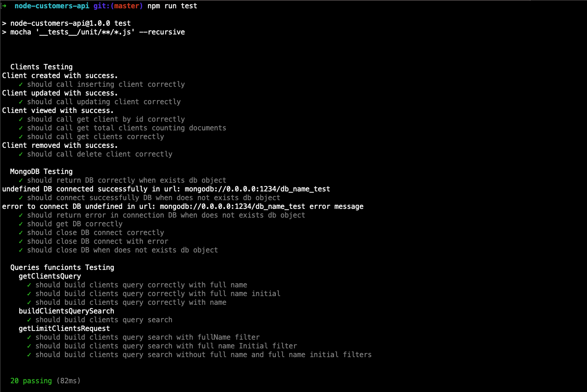
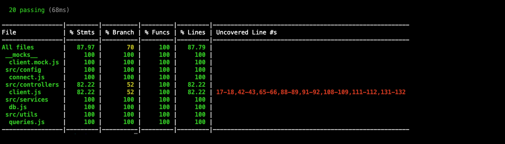
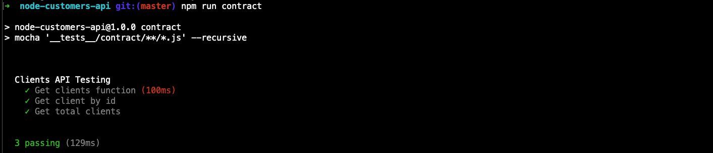

# NodeJS Customers API - example

This project is a customers API built in NodeJs. The project access to non relational database using MongoDB. Below you see the main steps to run project and run automatization tests. 

The main libraies and resources used in this project was:

Development 

* Nodejs
* MongoDB
* express

Testing

* Mocha
* Chai
* Sinon
* Sinon-mongo

Contract Testing

* Supertest
* Joi
* Chai

### Begining

First is important to know that this project contains environment variables, that you have use. The local variables are in .env.local and production enviroment variables are in .env.prod. So, to setup your development environment, run:

```
cp .env.local .env
```

### Install dependencies

First, install dependencies:

````
npm install
````

### Run

To run the project, you can execute this command below:

````
npm start
````

### Tests

To execute unit tests, run:

````
npm run test
`````




To run coverage to unit tests, run:

````
npm run coverage
`````



To run contract tests, run:

````
npm start
````

and in other terminal, run:

````
npm run contract
`````




